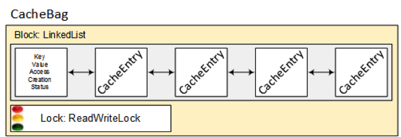
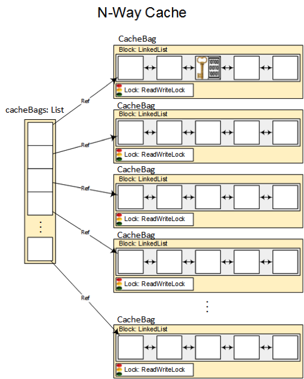
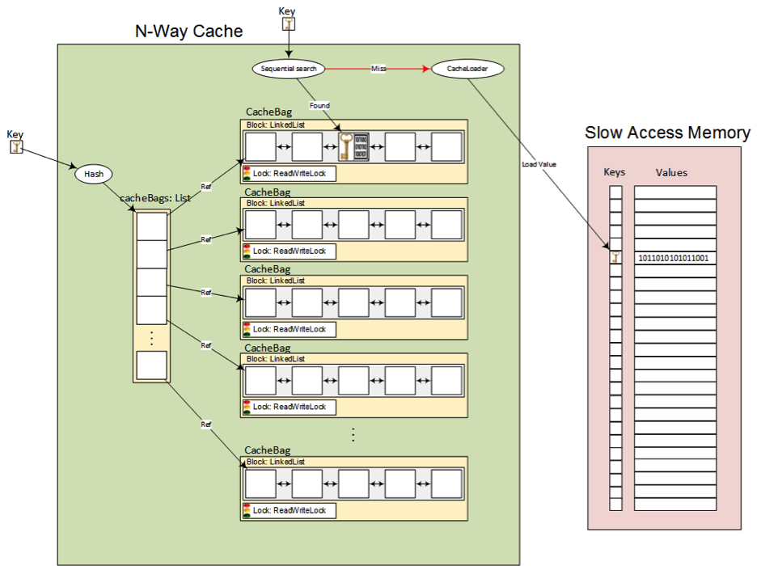

Library design
==============

## Memory structure

The cache is divided into sets where each set contains "N" cache entries. In order to provide concurrency access in read 
and write from multiple threads the set structure is called bag.  
Each bag contains a double linked list of `Cache` entry and a read write lock object.  
The read write object control the concurrent access.  
The `CacheEntry` contains the key, value, last access time, creation time and `CacheStatus`.  
CacheStatus define if the entry will be deleted on the next eviction or not.  
Graphically a Cache bag is represented as below:

All the `CacheBag` are inserted in the `cacheBags` list. This list is immutable and allocated during the cache initialization.

With also the `CacheBag` representation the diagrams become:

## Concurrency management

The concurrency is managed only at level of each independent `CacheBag` object.  
This is possible because the `cacheBags` List is immutable and defined at the nWay cache initialization.  
The usage of a `LinkedList` allow to use a write lock only when the `CacheEntry` in the `Block` is added or deleted. Any 
other operation require the read lock only.  
The usage of a concurrent list has been avoided because the class is synchronizing every access without making 
distinction between read and write.  
Read locks are used when:  

* An immutable copy of the `Block` is created in order to give to the `CacheEviction` implementation
* A key is searched inside the current Block

Write locks are used when:

* The entries in the block are deleted as result of the eviction
* A new entry is created

No lock are necessary when:

* Access time is updated (the variable is declared as volatile)
* The entry value is updated (the variable is declared as volatile)
* Any read to the entry object
* Getting access to the CacheBag object

## Behind the scenes for retrieving a value

The main operation of a cache is retrieving a value. For retrieving a value you must have a key.
 
1.   It is used the key.hash function for having an integer value.  This number is used to determine what is the key 
position in the `cacheBags` list via a mod operation
2.   The right cacheBag is retrieved
3.	A sequential search is applied to the block using the `key.equals()` function for find the right `CacheEntry`
4.	If a cache entry has been found then the value is returned to the user
5.	An entry is not present then the `CacheLoader` is invoked
6.	`CacheLoader` returns the value from some slow access memory (database, filesystem, network…)
7.	A new Entry is created with the current key and the value loaded
8.	The Entry is added in the block. (`LinkedList` always add at the end of the structure)
9.	The value is returned

In case of the `Block` size is equals or bigger than “N” an eviction is called at the beginning of step 7.  
Eviction is going to:

1.	Create an immutable list from the block. This operation is done via the guava immutable list class that is 
“smart” enough to avoid a physical copy if not necessary
2.	`Eviction` is called
3.	Every `CacheEntry` that has status to `DELETED` is going to be removed from the block
4.	If the size of the block is major that the double of “N” an `OutOfMemoryException` is generated
5.	A new Entry is created with the current key and the value loaded

